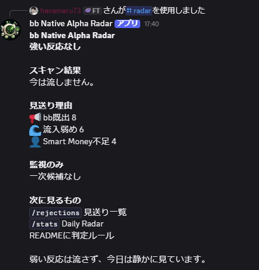
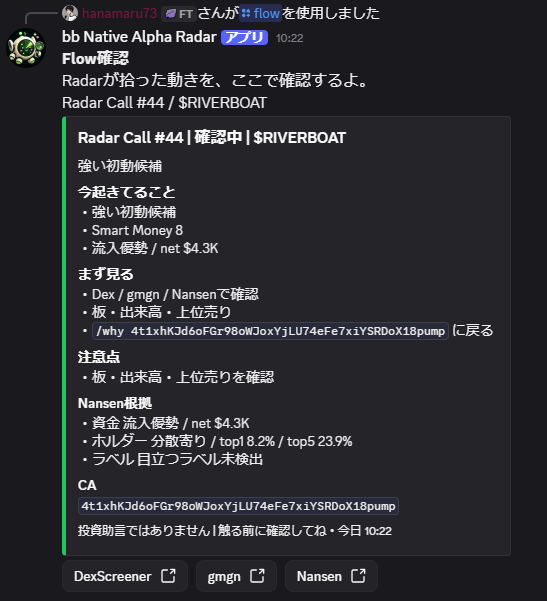
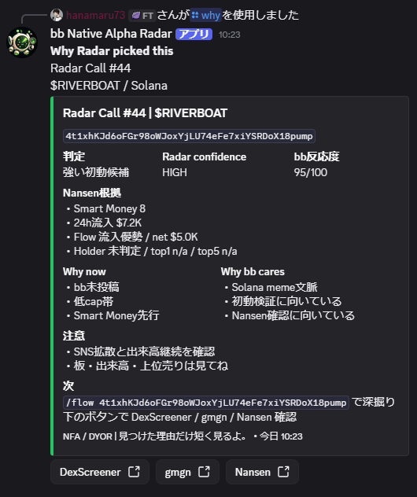
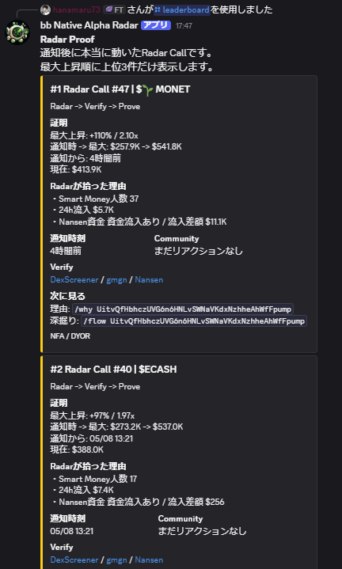
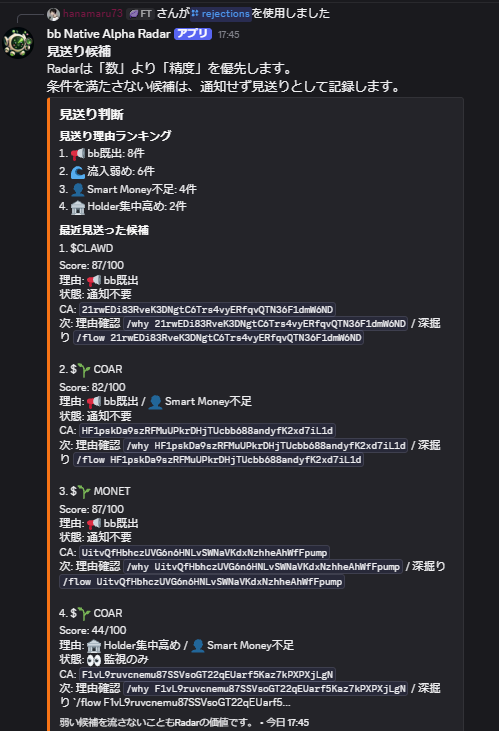
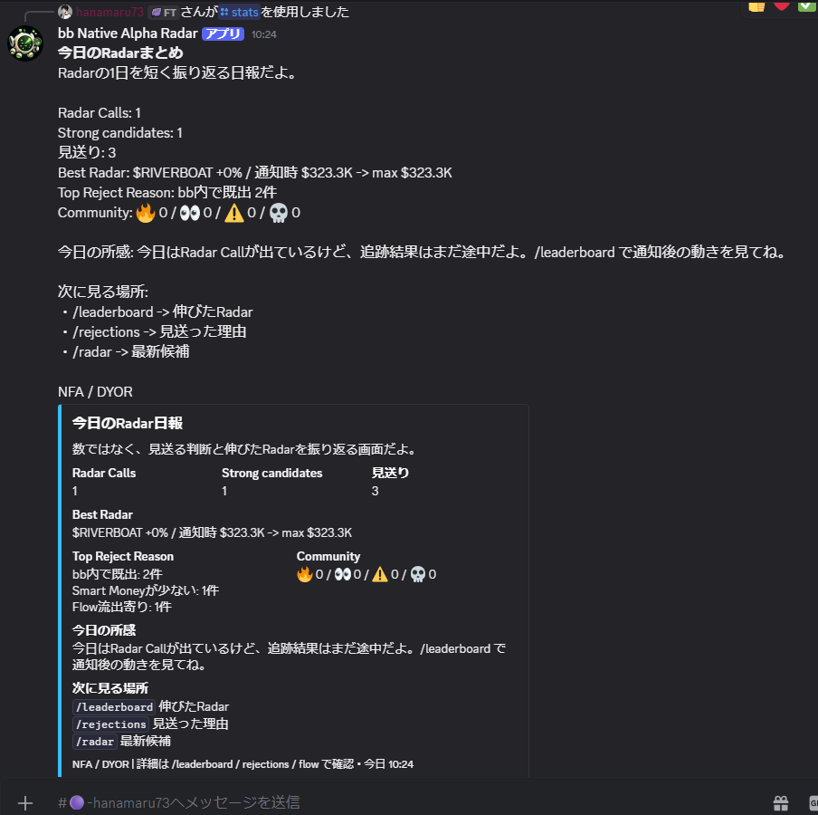
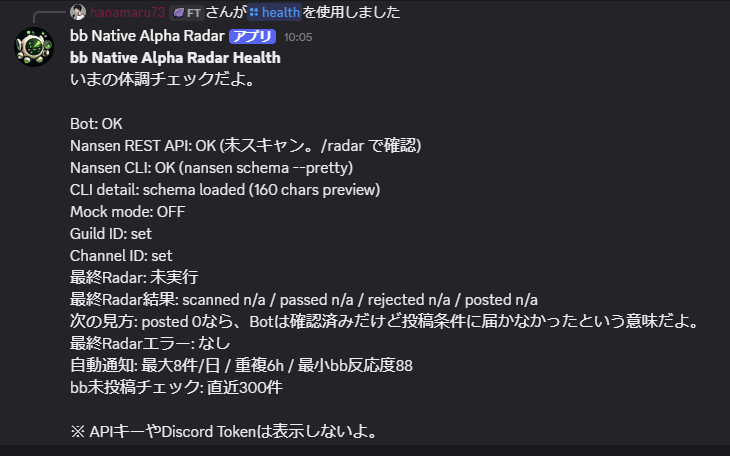

# bb Native Alpha Radar

bb Native Alpha Radar is a Discord-native pre-CA Radar for the bb community.

It is not a price bot. It is not a trading assistant. It does not tell users to buy or sell.

The bot uses Nansen Smart Money signals to notice early Solana lowcap meme movement before a CA becomes a bb-wide Discord narrative. It then keeps the output intentionally small, asks users to verify, records what happened, and turns the result into community memory.

## Discord Screenshots















## Core Loop

`Radar -> Verify -> Prove -> Community`

- `Radar`: detect a small number of pre-CA Solana candidates using Nansen Smart Money, Token Screener, and DEX trade context.
- `Verify`: use `/why <CA>` and `/flow <CA>` plus DexScreener, gmgn, and Nansen links before touching anything.
- `Prove`: save Radar Calls, track post-alert market-cap movement, and review outcomes through `/leaderboard` and `/stats`.
- `Community`: keep Radar Call IDs and Discord reactions as shared bb discussion objects.

## Why This Exists

Most lowcap bots become useful after somebody posts a CA. bb Native Alpha Radar looks one step earlier.

The question is not "what pumped?" The question is:

```text
What is Smart Money touching before bb starts talking about it?
```

That difference matters because bb Discord culture is fast, screenshot-driven, and noisy by default. A useful bot cannot flood the room. It must stay quiet most of the time, surface only a few candidates, and make the verification path obvious.

## Why It Is Different

- It is built for Discord screenshots, not a dashboard.
- It treats silence as product value when signals are weak.
- It keeps CA secondary so the first impression is Radar judgment, not link posting.
- It shows rejected/noisy candidates through `/rejections`, proving the filter instead of hiding it.
- It uses Nansen where Nansen changes the decision: Smart Money discovery, holders, wallet labels, and Flow Intelligence.
- It stores Radar Call IDs so the same candidate can be discussed across `/radar`, `/why`, `/flow`, `/leaderboard`, and `/stats`.

## Nansen Usage

Nansen is the engine behind the Radar, but the bot is designed to avoid wasteful credit usage.

Base Radar scan:

- `POST /smart-money/netflow`
- `POST /smart-money/dex-trades`
- `POST /token-screener`

Focused verification:

- `POST /tgm/holders`
- `POST /tgm/flow-intelligence`

CLI requirement:

- `nansen schema --pretty`

Credit philosophy:

- Broad scan first, deep enrichment only for likely Radar Calls.
- Recent bb history is checked before expensive enrichment when possible.
- `/flow <CA>` is allowed to spend deeper Nansen calls because a user explicitly requested one CA.
- `/health` avoids spending a live Nansen REST call just to poll status; it uses the latest Radar state plus Nansen CLI status.
- `/stats`, `/leaderboard`, and `/rejections` prefer saved data.

## Low-Noise Philosophy

The bot is intentionally selective.

Current production guardrails:

- Solana only.
- Market cap target: `<= $500K`.
- Token age target: `<= 30 days`.
- Smart Money traders: `>= 3`, or positive 24h Smart Money netflow.
- Recent bb messages are checked so already-posted CA/symbols can be skipped.
- Public-channel unsafe symbols are filtered.
- Default Radar display limit: `2`.
- Auto alerts are deduped for `6h`.
- Auto alert cap: `8/day`.

When there are no strong signals, `/radar` shows a no-signal state instead of forcing weak calls into the room.

## Why `/rejections` Matters

`/rejections` is part of the product, not a failure log.

It shows that the bot filtered weak candidates for reasons such as:

- already posted in bb,
- Nansen flow outflow bias,
- top-holder concentration,
- not enough Smart Money,
- score below policy.

This is how the bot proves it is not spam. It gives judges and bb users a way to see the negative space: the calls the bot refused to send.

## Discord UX

Visible Discord UI is Japanese-first because the bot is for Japanese bb Discord users.

The product surfaces are designed for three-second reading:

- `/radar`: what Radar noticed now.
- `/why <CA>`: why this Radar Call was picked.
- `/flow <CA>`: how to verify one CA with Nansen, trader-readable numbers, and market context.
- `/rejections`: why weak signals were skipped.
- `/stats`: daily Radar summary.
- `/leaderboard`: tracked Radar Call outcomes.
- `/health`: bot, Nansen CLI, and recent Radar status without exposing secrets.

CA appears where verification needs it, but it is intentionally not the visual hero.

## Demo Order

Recommended judge flow:

```text
/health
/radar
/flow <CA>
/why <CA>
/leaderboard
/rejections
/stats
```

What judges should understand first:

- This is not a price bot.
- It is a pre-CA Radar for the bb Discord room.
- It can say no when signals are weak.
- Nansen powers discovery and focused verification.
- Saved Radar Calls prove what happened afterward.

## Architecture

The runtime is intentionally small and Discord-native.

- `src/index.js`: Discord Gateway, slash command routing, scheduled Radar, tracking loop, daily summary.
- `src/radar.js`: candidate scoring, filtering, Discord message formatting, `/why`, `/flow`, `/leaderboard`, `/rejections`, and `/stats` surfaces.
- `src/nansen.js`: Nansen REST adapter.
- `src/nansenCli.js`: Nansen CLI health/schema check.
- `src/store.js`: local JSON persistence for alerts, scans, daily summary state, Radar Call IDs.
- `src/tracking.js`: post-alert market-cap tracking via DexScreener.
- `src/reactions.js`: Discord reaction collection.
- `src/marketData.js`: DexScreener market data helper.

Local memory:

- `data/alerts.json`: saved Radar Calls and tracking fields.
- `data/scans.json`: scan summaries and rejected candidates.
- `data/daily-summary.json`: daily summary dedupe state.

These files are ignored by git and should not be committed.

## Dependencies

Runtime requirements:

- Node.js `>=22`.
- Nansen CLI installed globally for hackathon requirement and `/health`.
- Nansen API key in `.env`.
- Discord bot token, client ID, channel ID, and optional guild ID in `.env`.

No Discord SDK is required. The bot uses Discord REST/Gateway directly.

## Setup

Install dependencies:

```powershell
npm install
```

Install Nansen CLI:

```powershell
npm install -g nansen-cli
```

Authenticate Nansen CLI:

```powershell
nansen login --human
```

Copy `.env.example`:

```powershell
copy .env.example .env
```

Fill in `.env`:

```env
DISCORD_TOKEN=your_discord_bot_token
DISCORD_CLIENT_ID=your_discord_application_id
DISCORD_CHANNEL_ID=your_alert_channel_id
DISCORD_GUILD_ID=your_test_guild_id
NANSEN_API_KEY=your_nansen_api_key

ALERT_INTERVAL_MINUTES=30
TRACKING_INTERVAL_MINUTES=15
MARKET_CAP_MAX_USD=500000
TOKEN_AGE_MAX_DAYS=30
MIN_BB_SCORE=88
RADAR_DISPLAY_LIMIT=2
MAX_DAILY_ALERTS=8
DEDUPE_HOURS=6
MIN_SMART_MONEY_TRADERS=3
BB_LOOKBACK_MESSAGES=300
DAILY_SUMMARY_ENABLED=true
DAILY_SUMMARY_HOUR=23
DAILY_SUMMARY_MINUTE=50
DAILY_SUMMARY_TIMEZONE=Asia/Tokyo
MOCK_MODE=false
```

Never commit or share `DISCORD_TOKEN` or `NANSEN_API_KEY`.

Current submission runtime uses `MOCK_MODE=false` and keeps Daily Summary enabled at `23:50` JST. If you change `.env`, restart the bot so the new values are loaded.

## Run And Stop

Recommended Windows start:

```powershell
.\start-bot.cmd
```

PowerShell start:

```powershell
.\start-bot.ps1
```

Stop a stray/background bot process for this repo:

```powershell
.\stop-bot.cmd
```

Direct foreground run if Node.js is available in PATH:

```powershell
node src/index.js
```

Recommended development operation:

1. Start from the primary repo path with `.\start-bot.cmd`.
2. Keep the bot in the foreground while actively testing Discord behavior.
3. Stop it as soon as the check is finished with `Ctrl+C`, closing the terminal window, or `.\stop-bot.cmd`.

Background start is not recommended during development because scheduled scans can continue spending Nansen credits every `ALERT_INTERVAL_MINUTES`. Daily Summary itself uses saved stats, but keep the bot stopped when you are not intentionally testing scheduled behavior.

## Checks

Run before every push:

```powershell
npm.cmd run check:all
```

The check currently verifies JavaScript syntax for all runtime modules.

## Submission Assets

Minimum submission:

- GitHub URL or intro tweet URL.
- Working Discord bot using Nansen CLI.
- README with setup and usage.
- No committed secrets.

Stronger submission:

- Demo video.
- Discord dark mode screenshots.
- `REPORT.md`.
- Architecture/dependency/setup explanation.
- Clear proof that the bot is not a price bot and not a dashboard.

## Safety

- Secrets are loaded from `.env`.
- `.env` and local JSON data are ignored by git.
- API keys and Discord tokens are never printed in Discord output.
- The bot does not execute trades.
- The bot does not provide buy/sell calls, entries, exits, or targets.
- Daily alert limits, dedupe windows, and rejection visibility reduce spam risk.
- Public-channel safety filtering removes suspicious/offensive/NSFW token symbols.
- Required Discord permissions are minimal: View Channel, Send Messages, Embed Links, Read Message History, and Use Application Commands.

## Project Management

Primary execution tracker:

- `HACKATHON_MANAGEMENT.md`

Guardrail docs:

- `AGENTS.md`
- `docs/GUARDRAILS.md`
- `docs/COMMAND_UX.md`
- `docs/NANSEN_USAGE.md`
- `docs/DATA_COMPATIBILITY.md`
- `docs/GITHUB_PROJECT.md`

## AI Disclosure

OpenAI ChatGPT / Codex was used for product design, implementation support, debugging, and documentation drafting.

## License

Hackathon production submission.
